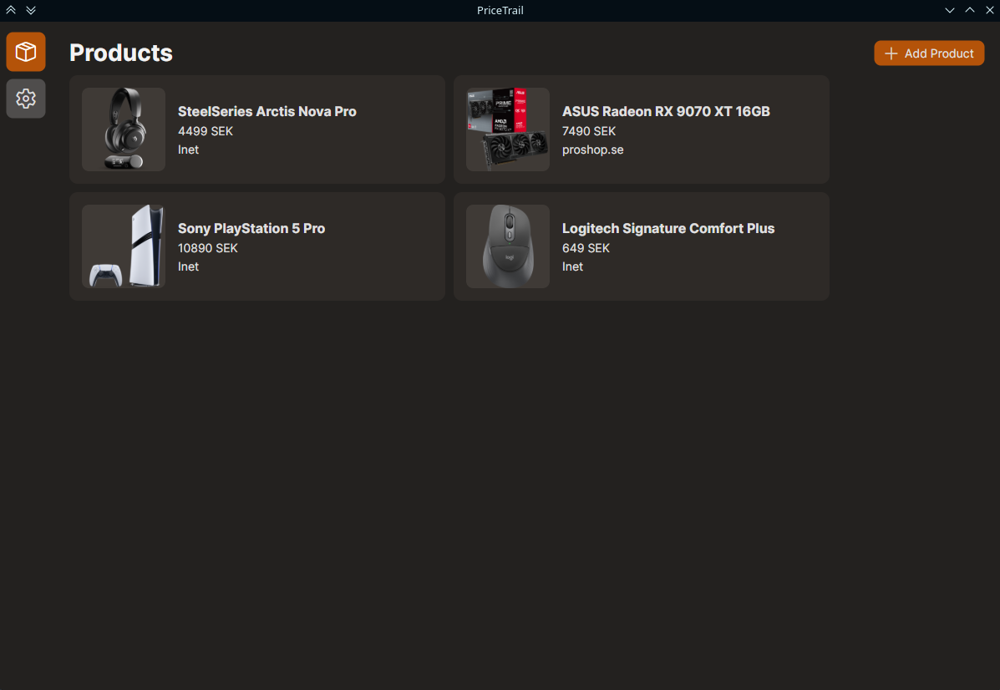
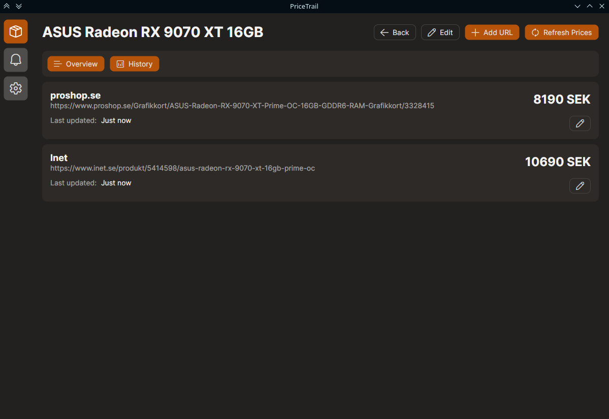
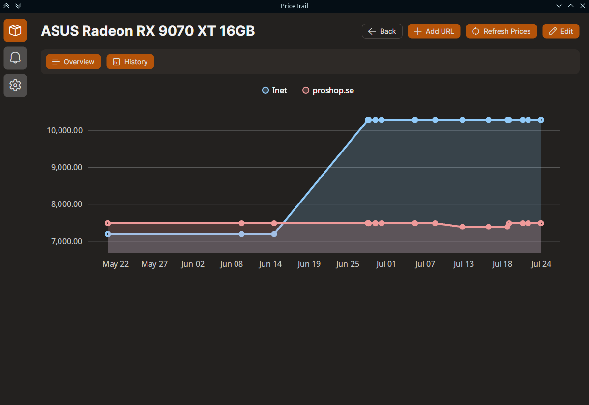

#  PriceTrail

PriceTrail is a free desktop application for tracking product prices across multiple online stores.

Add product URLs from different stores, and PriceTrail will automatically extract pricing information using JSON-LD data embedded in product pages.

⚠️ If you are using a VPN, some websites may block you. You may want to exclude PriceTrail from your VPN.

## Features

- Compare prices across multiple stores
- Automatic price extraction using JSON-LD
- Price history tracking
- Automatic price refreshes
- Price alerts

## Planned Features

- Improved UI (visuals and features)

## Screenshots

